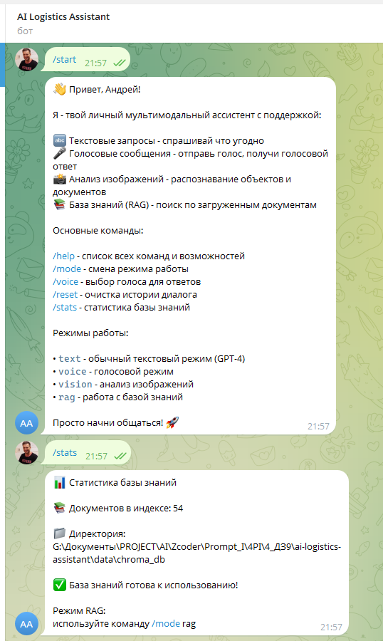
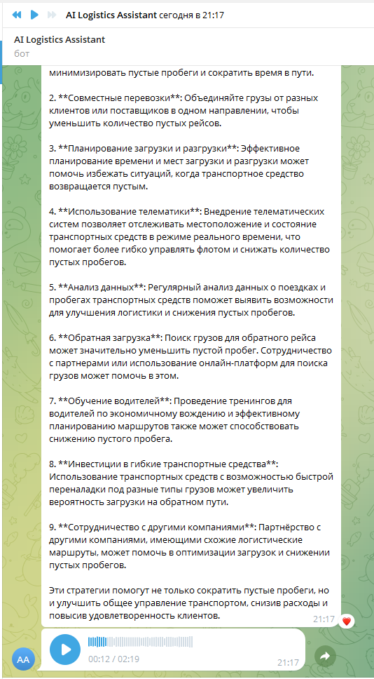
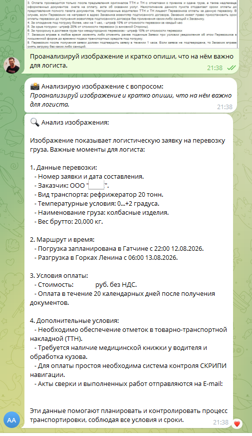

# 🚚 AI Logistics Assistant

### Multimodal AI Assistant for Transport & Refrigerated Logistics

AI-ассистент для транспортной компании с поддержкой **RAG**, **Telegram**, **Voice**, **Vision**, **STT/TTS** и интеллектуальной маршрутизацией запросов.

---

## ✨ Возможности

✅ Ответы в обычном текстовом режиме
✅ Ответы по базе знаний (RAG)
✅ Распознавание голосовых сообщений (STT)
✅ Голосовые ответы (TTS)
✅ Анализ изображений и документов (Vision)
✅ Работа через Telegram-бота
✅ Переключение режимов через команды

---

## 🧠 Что умеет ассистент

### 📚 RAG (Knowledge Base)

Находит ответы в документах компании вместо генерации «из головы».

Примеры:

* Что делать при опоздании машины?
* Какие правила перевозки рефрижераторных грузов?
* Какие действия при простое?

---

### 🎤 Voice Mode

Голос → распознавание → модель → ответ → голос

Примеры:

* «Как снизить пустой пробег?»
* «Что делать при задержке доставки?»

---

### 🖼️ Vision Mode

Анализирует:

* скриншоты заявок;
* изображения документов;
* логистические данные;
* фотографии.

Выделяет ключевые параметры и формирует вывод.

---

## 🏗 Архитектура

```text
Пользователь
      ↓
Telegram Bot
      ↓
handlers/[text/voice/image/rag]
      ↓
services/router.py
      ↓
┌─────────────────────────────┐
│ OpenAI                      │
│ • LLM                       │
│ • Vision                    │
│ • STT                       │
│ • TTS                       │
└─────────────────────────────┘
      +
┌─────────────────────────────┐
│ ChromaDB                    │
│ • Vector Search             │
│ • Knowledge Base (RAG)      │
└─────────────────────────────┘
      ↓
Ответ пользователю
```

---

## 📁 Структура проекта

```text
handlers/     → Telegram handlers
services/     → бизнес-логика и маршрутизация
rag/          → индексация и поиск
data/         → документы базы знаний
utils/        → вспомогательные функции
tests/        → тестирование
```

---

## 📚 База знаний

Документы:

```text
data/documents/
```

Используются:

```text
company_processes.txt
logist_faq.txt
refrigerated_transport_rules.txt
```

---

## ⚙️ Установка

### 1. Клонирование

```bash
git clone https://github.com/andrgol12-sys/ai-logistics-assistant.git
cd ai-logistics-assistant
```

### 2. Создать окружение

```bash
python -m venv .venv
```

### 3. Активировать

Windows:

```bash
.venv\Scripts\Activate.ps1
```

### 4. Установить зависимости

```bash
pip install -r requirements.txt
```

### 5. Создать `.env`

```env
OPENAI_API_KEY=your_key
TELEGRAM_BOT_TOKEN=your_token

USE_PROXYAPI=false

OPENAI_MODEL=gpt-4o-mini
OPENAI_VISION_MODEL=gpt-4o-mini
```

---

## ▶️ Запуск

```bash
python main.py
```

---

## 🤖 Команды Telegram

```text
/start
/help
/stats

/mode text
/mode rag
/mode voice

/reset
```

---

## 🧪 Примеры

### RAG

```text
/mode rag
Что делать, если машина опаздывает на погрузку?
```

---

### Text

```text
/mode text
Какие способы повысить эффективность логистики?
```

---

### Voice

```text
/mode voice
[голосовое сообщение]
```

---

### Vision

```text
[изображение]
Проанализируй документ
```

---

## 📸 Скриншоты работы

### 📚 RAG — работа с базой знаний

Бот использует проиндексированные документы компании для поиска информации и формирования ответов.

<a href="docs/screenshots/rag-example.png">
  
</a>

---

### 🎙️ Voice — голосовой режим

Ассистент принимает голосовые запросы и может формировать голосовой ответ.

<a href="docs/screenshots/voice-example.png">
  
</a>

---

### 🖼️ Vision — анализ документов и изображений

Ассистент анализирует изображение логистического документа, извлекает ключевые данные и формирует структурированный результат.

<a href="docs/screenshots/vision-example.png">
  
</a>

---

## 🚀 Используемые технологии

* Python
* Telegram Bot API
* OpenAI API
* ChromaDB
* LangChain
* RAG
* STT
* TTS
* Vision

---

## 🎓 Учебный проект

Проект выполнен в рамках курса **Zerocoder — PEm09**.

Цель — создание мультимодального персонального ассистента для практических задач транспортной логистики.

---

### ⭐ Если проект понравился — поставьте звезду репозиторию
